

  

  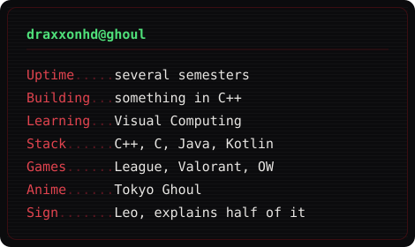
  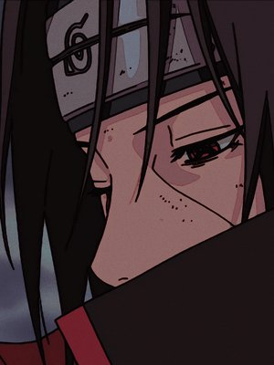

  

  
  
  

  

  
  

## about

I have touched a bit of everything so far: backends, web, Android, a Unity game, some machine learning. C++ was love at first sight, though.

When I am not coding I am gaming, painting, or sending memes to people who did not ask for them. Codes like a wolf, naps like an otter.

## stack

  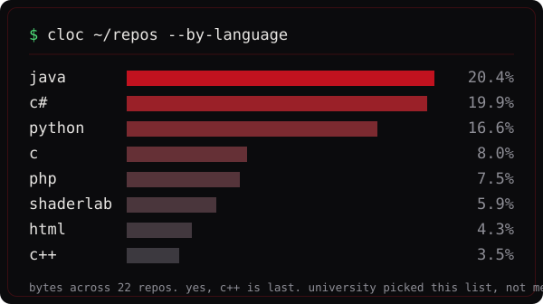

## the tour

  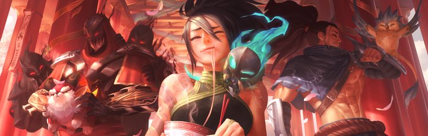

  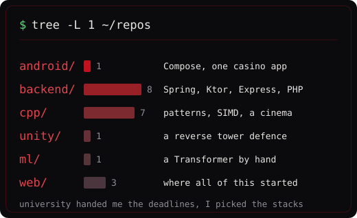

University handed me the deadlines, I picked the stacks. C++ was love at first sight, the rest was curiosity.

## commit habits

  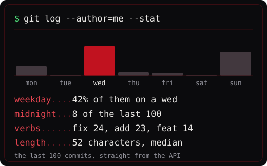
  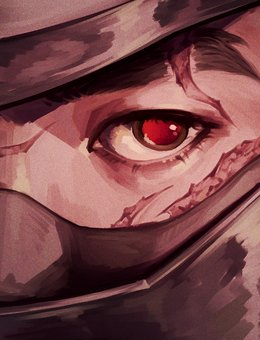

No 3am hero commits here. Peak output is the late morning, which is the least rock and roll fact about me.

## the numbers

  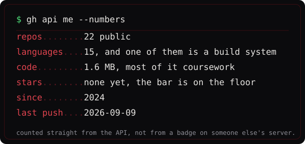

Counted from the API and committed as a file, so nothing here breaks when someone else's
badge service goes offline. It refreshes itself once a day.

## since june 2024

  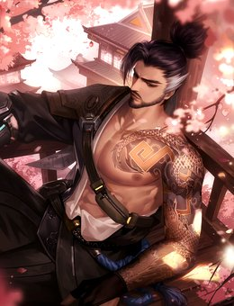
  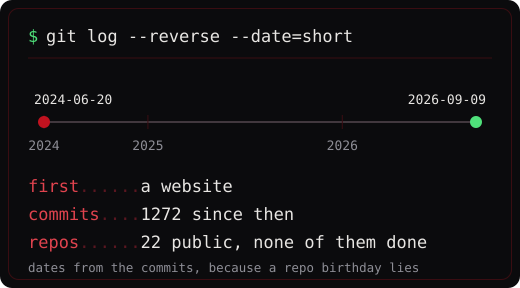

The dates come from the commits, not from the repos. Those were recreated in one go and all claim the same birthday, which is a nice reminder that metadata lies.

## housekeeping

  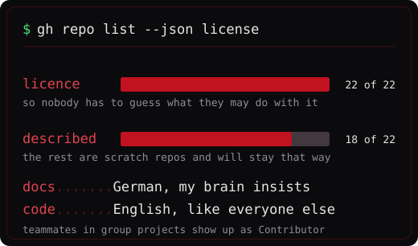
  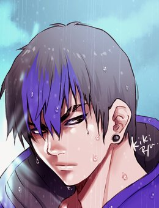

Boring, and the reason I can still read my own repos six months later. The few without a description are scratch repos and they will stay that way.

## two I think about

**The deep learning one.** I built the attention myself, then SFT, then DPO, then LoRA, then a RAG pipeline on top because why not. Everyone writes the model. Nobody warns you that cleaning the data takes four times as long as training on it.

**The Minecraft mod.** It shipped with lesson plans, because it was built for a workshop with kids. Best code review of my life came from a twelve year old asking why the block does nothing. If they cannot build it in twenty minutes, the feature goes.

## off the clock

  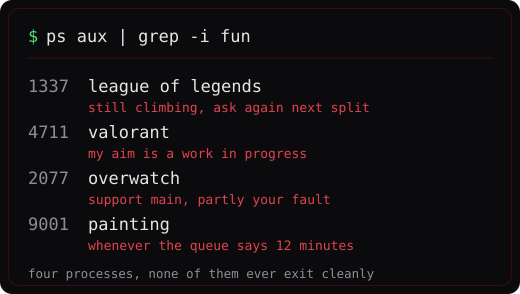
  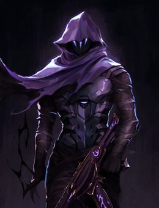

## setup

  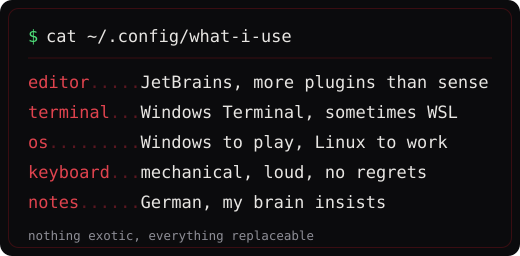

## repos

Mostly uni projects and things I wanted to understand properly. Docs are usually German, code is English, commit messages are whatever mood I was in. Teammates in group projects show up as `Contributor`, that is on purpose.

The pinned repos below are the ones I would actually show someone.

## git status

  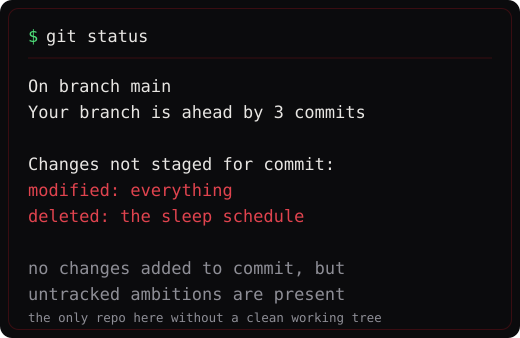

#### licences

What is mine and what is not

Apps: **AGPL-3.0** &middot; small examples: **MIT** &middot; my own design work, including the SVGs in this repo: **CC BY-SA 4.0**. Details in each repo.

The anime artwork on this page belongs to its respective creators and publishers. It is used here for personal, non-commercial decoration and is **not** covered by the licence above.

  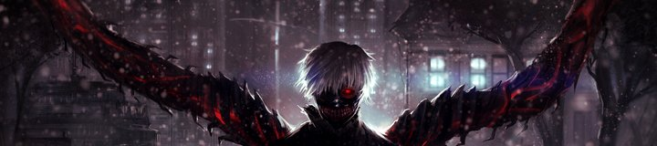

<picture>
  <source media="(prefers-color-scheme: dark)" srcset="https://raw.githubusercontent.com/DraxxonHD/DraxxonHD/output/github-contribution-grid-snake-dark.svg">
  <source media="(prefers-color-scheme: light)" srcset="https://raw.githubusercontent.com/DraxxonHD/DraxxonHD/output/github-contribution-grid-snake.svg">
  
</picture>
